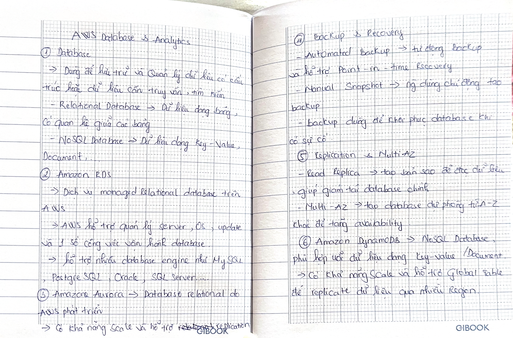
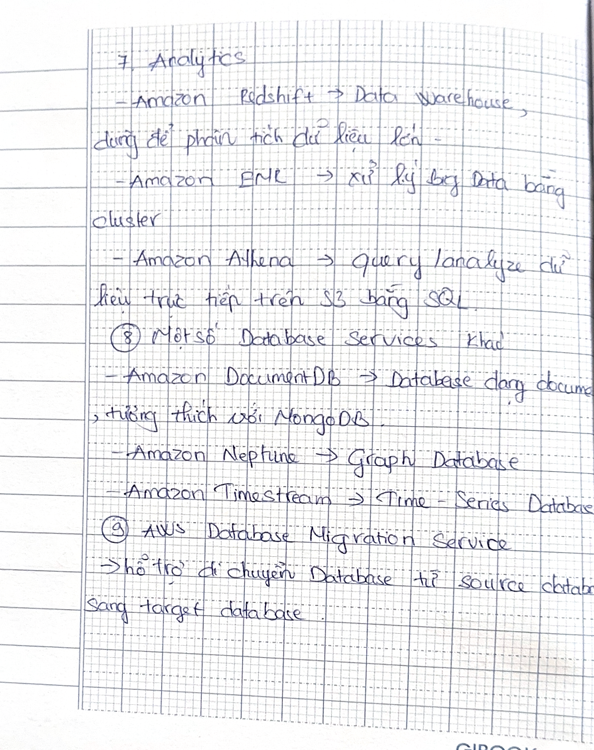

# AWS Database & Analytics

### 1. Database

**Database** → used to store and manage structured data or data that needs to be queried and searched.

- **Relational Database** → data is organized into tables with relationships between tables.
- **NoSQL Database** → data can be stored as **Key-Value, Document**, etc.

### 2. Amazon RDS

**Amazon RDS** → a **managed relational database** service on AWS.  
→ AWS helps manage the server, OS, updates, and some database operations.  
→ Supports database engines such as **MySQL, PostgreSQL, Oracle, SQL Server**, etc.

### 3. Amazon Aurora

**Amazon Aurora** → a relational database developed by **AWS**.
→ Supports **scaling** and **replication**.

### 4. Backup & Recovery

- **Automated Backup** → automatically backs up data and supports **Point-in-Time Recovery**.
- **Manual Snapshot** → users manually create a backup.
- Backup is used to **restore the database when a problem occurs**.

### 5. Replication & Multi-AZ

- **Read Replica** → creates a copy for **reading data**, helping reduce the load on the primary database.
- **Multi-AZ** → creates a standby database in another AZ to improve **availability**.

### 6. Amazon DynamoDB

**DynamoDB** → a **NoSQL database** suitable for **Key-Value / Document** data.  
→ Supports scaling and **Global Tables** for replicating data across multiple Regions.

### 7. Analytics

- **Amazon Redshift** → **Data Warehouse**, used to analyze large amounts of data.
- **Amazon EMR** → processes **Big Data** using clusters.
- **Amazon Athena** → queries/analyzes data directly in **S3** using SQL.

### 8. Other Database Services

- **Amazon DocumentDB** → document database compatible with MongoDB.
- **Amazon Neptune** → **Graph Database**.
- **Amazon Timestream** → **Time-Series Database**.

### 9. AWS Database Migration Service

**AWS DMS** → helps **migrate databases** from a source database to a target database.

