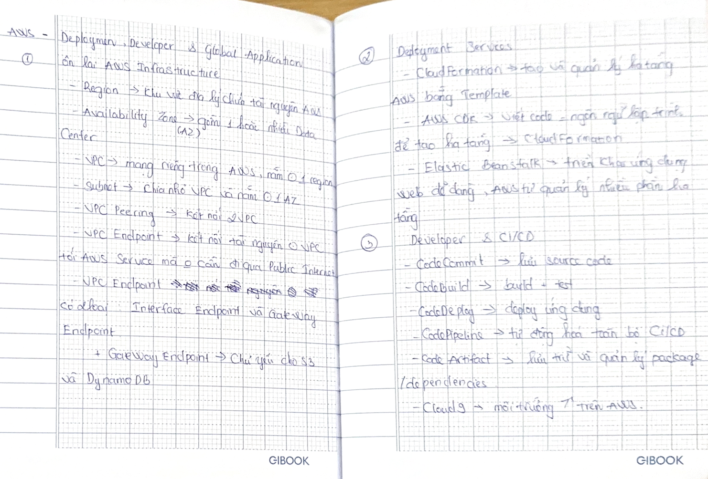
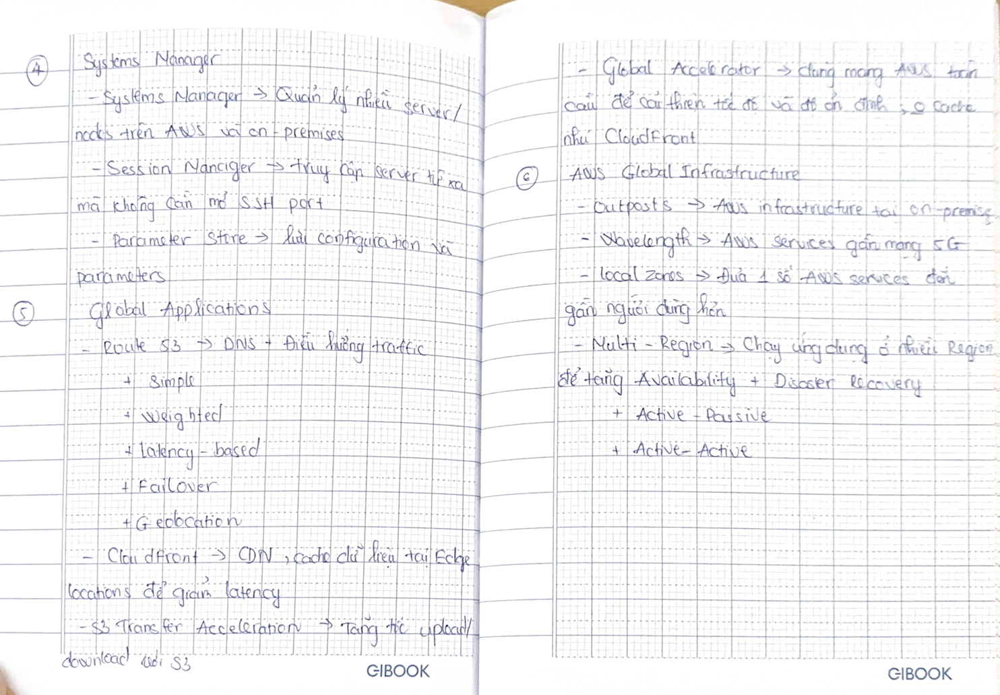

# AWS – Deployment & Global Applications

### 1. AWS Infrastructure Review

- **Region** → a geographic area that contains AWS resources.
- **Availability Zone (AZ)** → consists of one or more Data Centers.
- **VPC** → a private network in AWS, located within **one Region**.
- **Subnet** → divides a VPC into smaller networks and exists within **one AZ**.
- **VPC Peering** → connects two VPCs.
- **VPC Endpoint** → connects resources in a VPC to an AWS Service without going through the **Public Internet**.
- **VPC Endpoint** has two types:
  - **Interface Endpoint**
  - **Gateway Endpoint** → mainly used for **S3 and DynamoDB**.

### 2. Deployment Services

- **CloudFormation** → creates and manages AWS infrastructure using **Templates (Infrastructure as Code)**.
- **AWS CDK** → uses programming languages to define infrastructure → **CloudFormation**.
- **Elastic Beanstalk** → makes it easy to deploy web applications; AWS manages many parts of the infrastructure.

### 3. Developer & CI/CD

**CodeCommit** → stores source code  
**CodeBuild** → builds + tests code  
**CodeDeploy** → deploys applications  
**CodePipeline** → automates the entire CI/CD process  
**CodeArtifact** → stores and manages packages/dependencies  
**Cloud9** → development environment on AWS.

### 4. Systems Manager

- **Systems Manager** → manages multiple servers/nodes on AWS and on-premises.
- **Session Manager** → remotely accesses servers without opening an SSH port.
- **Parameter Store** → stores configuration and parameters.

### 5. Global Applications

- **Route 53** → DNS + traffic routing.
  - Simple
  - Weighted
  - Latency-based
  - Failover
  - Geolocation
- **CloudFront** → CDN; caches data at **Edge Locations** to reduce latency.
- **S3 Transfer Acceleration** → speeds up upload/download with S3.
- **Global Accelerator** → uses the global AWS network to improve speed and reliability; **does not cache** like CloudFront.

### 6. AWS Global Infrastructure

- **Outposts** → AWS infrastructure at on-premises locations.
- **Wavelength** → AWS services close to **5G** networks.
- **Local Zones** → brings some AWS services closer to users.
- **Multi-Region** → runs applications across multiple Regions to improve **Availability + Disaster Recovery**.
  - **Active-Passive**
  - **Active-Active**

