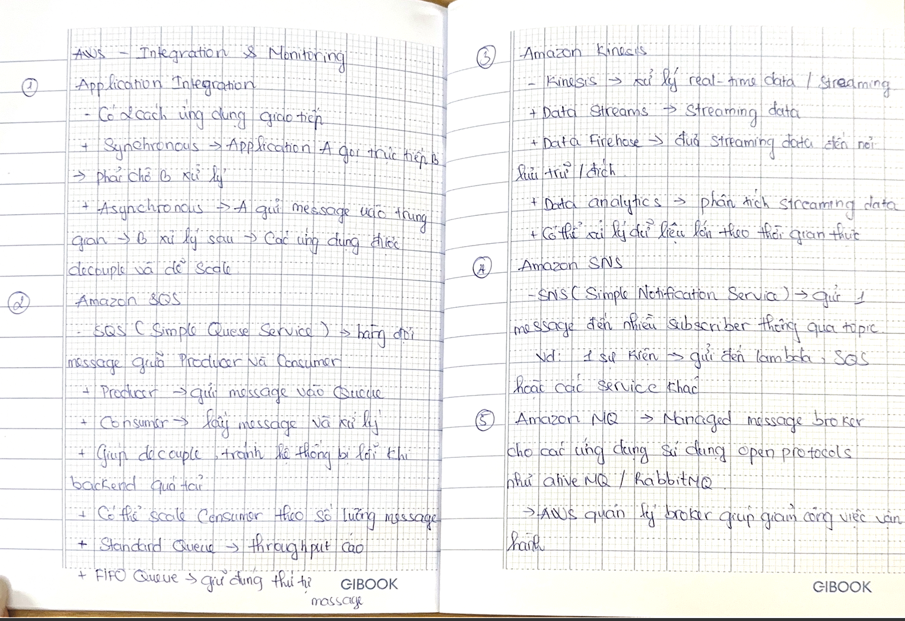
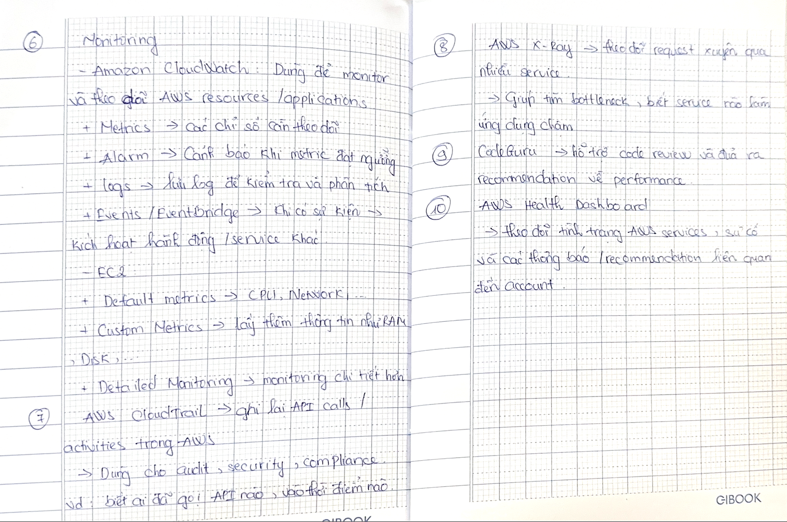

# AWS – Integration & Monitoring

### 1. Application Integration

There are two ways applications communicate:

- **Synchronous** → Application A directly calls B → A must wait for B to process the request.
- **Asynchronous** → A sends a message to an intermediary → B processes it later → applications are **decoupled** and easier to scale.

### 2. Amazon SQS

**SQS (Simple Queue Service)** → a message queue between **Producers** and **Consumers**.

- **Producer** → sends messages to the Queue.
- **Consumer** → receives and processes messages.
- Helps **decouple** applications and prevents system failures when the backend is overloaded.
- Consumers can scale based on the number of messages.
- **Standard Queue** → high throughput.
- **FIFO Queue** → maintains the correct message order.

### 3. Amazon Kinesis

**Kinesis** → processes **real-time data / streaming data**.

- **Data Streams** → handles streaming data.
- **Data Firehose** → delivers streaming data to storage or other destinations.
- **Data Analytics** → analyzes streaming data.
- Can process large amounts of data in real time.

### 4. Amazon SNS

**SNS (Simple Notification Service)** → sends **one message to multiple subscribers** through a **Topic**.

Example: One event → sends messages to Lambda, SQS, or other services.

### 5. Amazon MQ

**Amazon MQ** → a managed message broker for applications that use **open protocols** such as ActiveMQ/RabbitMQ.

→ AWS manages the broker, reducing operational work.

### 6. Monitoring

### Amazon CloudWatch

Used to **monitor and track AWS resources and applications**.

- **Metrics** → measurements that need to be monitored.
- **Alarm** → sends an alert when a metric reaches a threshold.
- **Logs** → stores logs for troubleshooting and analysis.
- **Events / EventBridge** → when an event occurs → triggers an action or another service.

**EC2:**

- **Default Metrics** → CPU, Network, etc.
- **Custom Metrics** → provides additional information such as RAM, Disk, etc.
- **Detailed Monitoring** → provides more detailed monitoring.

### 7. AWS CloudTrail

**CloudTrail** → records **API calls / activities** in AWS.

→ Used for **audit, security, and compliance**.

Example: Identify **who called which API and when**.

### 8. AWS X-Ray

**X-Ray** → traces requests across multiple services.

→ Helps identify **bottlenecks** and determine which service is making the application slow.

### 9. CodeGuru

**CodeGuru** → helps with **code reviews** and provides **performance recommendations**.

### 10. AWS Health Dashboard

→ Monitors the **status of AWS services**, service issues, and notifications/recommendations related to your account.

