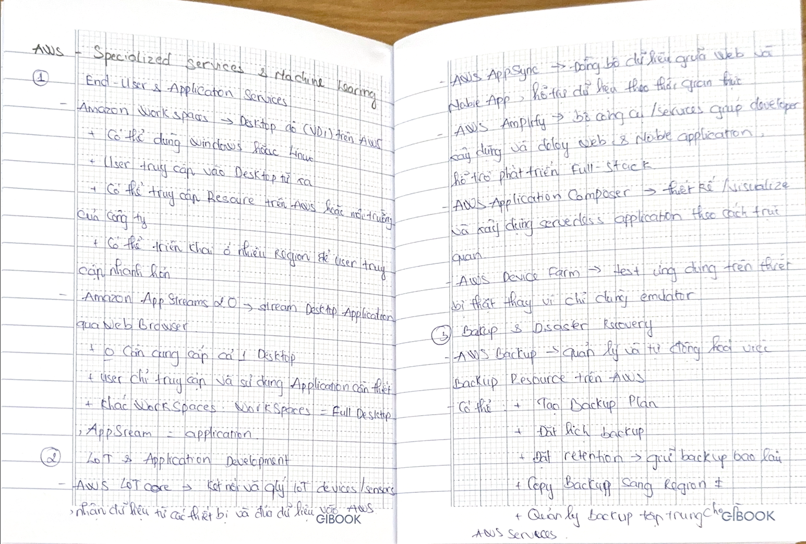
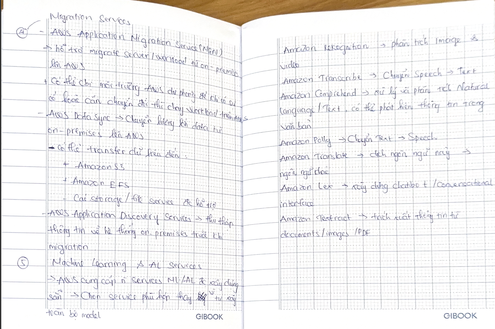

# AWS – Specialized Services & Machine Learning

### 1. End-User & Application Services

**Amazon WorkSpaces** → Virtual Desktop Infrastructure (VDI) on AWS.

- Supports **Windows or Linux**.
- Users can access their Desktop remotely.
- Can access resources on AWS or the company's environment.
- Can be deployed in multiple Regions for faster user access.

**Amazon AppStream 2.0** → streams **Desktop Applications** through a web browser.

- No need to provide a full Desktop.
- Users only access and use the required Application.
- **WorkSpaces = full desktop**, **AppStream = application**.

### 2. IoT & Application Development

**AWS IoT Core** → connects and manages **IoT devices/sensors**, receives data from devices, and sends data to AWS.

**AWS AppSync** → synchronizes data between **Web and Mobile Apps** and supports real-time data. Can integrate with services such as DynamoDB and Lambda.

**AWS Amplify** → a set of tools/services for building and deploying **Web & Mobile applications**, supporting Full-Stack development.

**AWS Application Composer** → visually designs and builds **serverless applications**.

**AWS Device Farm** → tests applications on **real devices** (mobile/web) instead of only using emulators.

### 3. Backup & Disaster Recovery

**AWS Backup** → manages and automates **resource backups** on AWS.

Can:

- Create a **Backup Plan**.
- Schedule backups.
- Set **Retention** → how long backups are kept.
- Copy backups to another Region.
- Centrally manage backups for multiple AWS services.

### 4. Migration Services

**AWS Application Migration Service (MGN)** → helps migrate servers/workloads from **on-premises to AWS**.

Can prepare a recovery environment on AWS so that workloads can run on AWS when a failure occurs or a cutover is needed.

**AWS DataSync** → transfers large amounts of **data from on-premises to AWS**.

Can transfer data to:

- Amazon S3
- Amazon EFS
- Supported storage/file services.

**AWS Application Discovery Service** → collects information about on-premises systems before **migration**.

Helps identify:

- Existing servers.
- Configuration.
- Performance.
- Dependencies.
- Information needed for migration planning.

### 5. Machine Learning & AI Services

AWS provides many pre-built ML/AI services → choose the appropriate service instead of building the entire model from scratch.

**Amazon Rekognition**  
→ analyzes **Images & Videos**.

Used for:

- Object detection
- Face detection
- Image/video analysis
- Labeling

**Amazon Transcribe**  
→ converts **Speech → Text**.

**Amazon Comprehend**  
→ processes and analyzes **Natural Language / Text** and can identify information in text.

**Amazon Polly**  
→ converts **Text → Speech**.

**Amazon Translate**  
→ translates **one language → another language**.

**Amazon Lex**  
→ builds **chatbots / conversational interfaces**.

**Amazon Textract**  
→ extracts information from **documents/images/PDFs**, such as:

- ID
- Name
- Information fields in documents.

