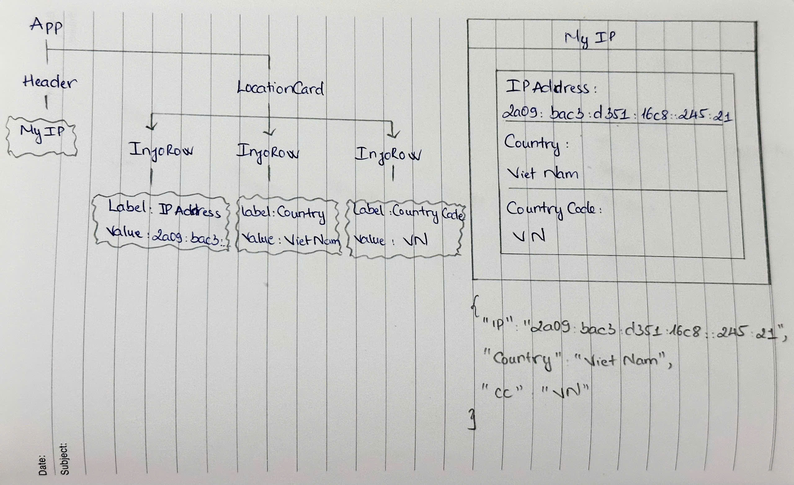

# Day 1 – Planning the My IP Project

Today, I started planning my **My IP** project. Before writing any code, I spent some time exploring the API, analyzing the response data, and sketching the user interface.

**API:** [https://api.miip.my/](https://api.miip.my/)

**Response:**

```json
{
  "ip": "2a09:bac3:d351:16c8::245:21",
  "country": "Viet Nam",
  "cc": "VN"
}
```

From the API response, I identified the information that the app will display:

* IP Address
* Country
* Country Code

I also divided the UI into reusable components to make the project easier to build and maintain:

```text
App
├── Header
└── LocationCard
      ├── InfoRow
      ├── InfoRow
      └── InfoRow
```

In this structure, **InfoRow** is a reusable component that receives two values:

* **Label:** the field name (IP Address, Country, Country Code)
* **Value:** the corresponding data from the API

Finally, I sketched the UI and the component structure on paper to get a clear overview before starting development.

**UI Sketch**

