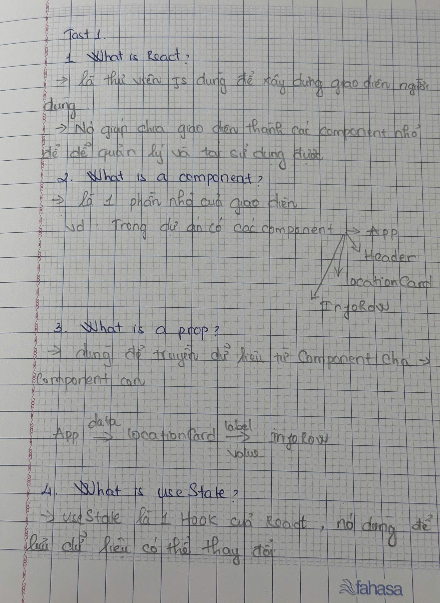
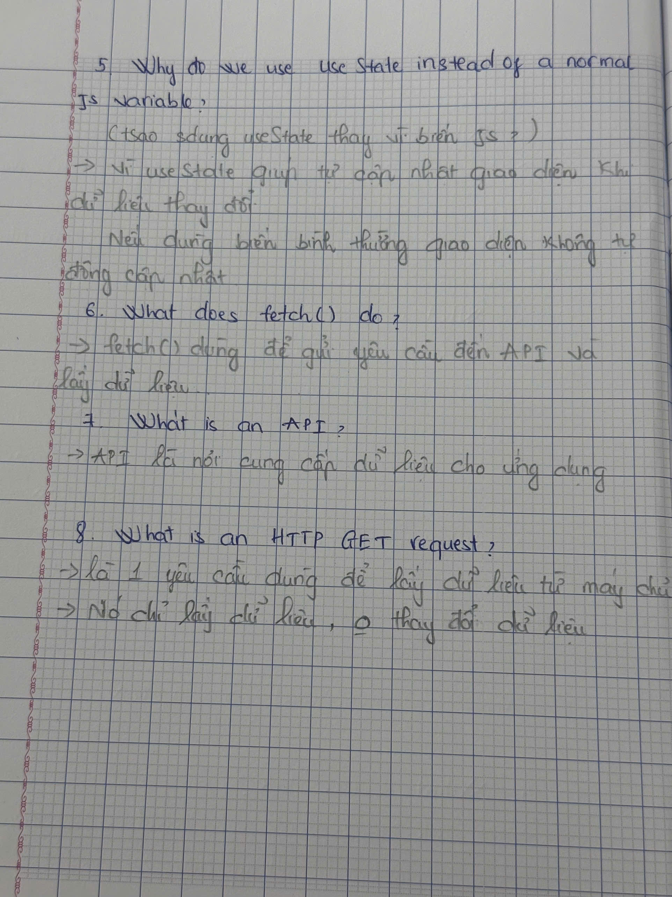
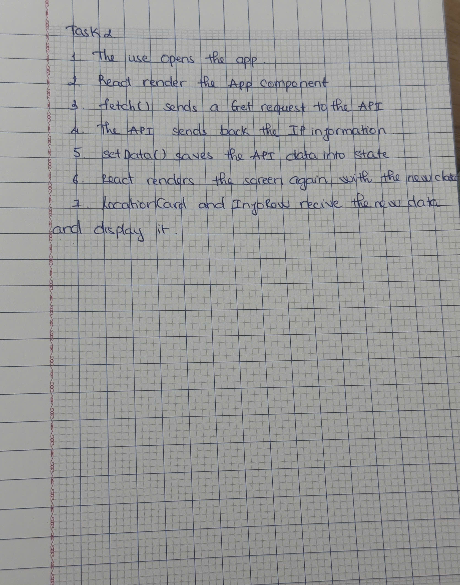

# Day 4 – Understanding My App

Today I reviewed the basic React concepts before continuing to build my app.

I answered questions about React, components, props, useState, fetch(), APIs, and HTTP GET requests in my own words. I also reviewed the flow of my IP app, from opening the app to displaying the data after the API response.

To help me understand the concepts better, I wrote all of my notes by hand in my notebook. My notebook is written in Vietnamese because it helps me learn and remember the concepts more easily.

**Notebook Notes**

