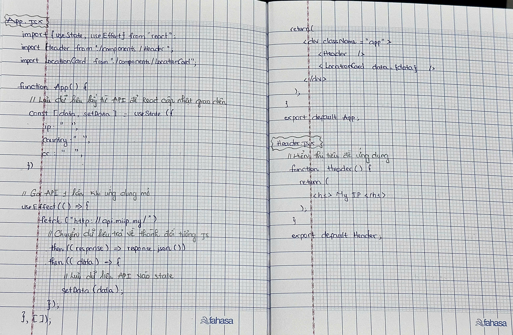
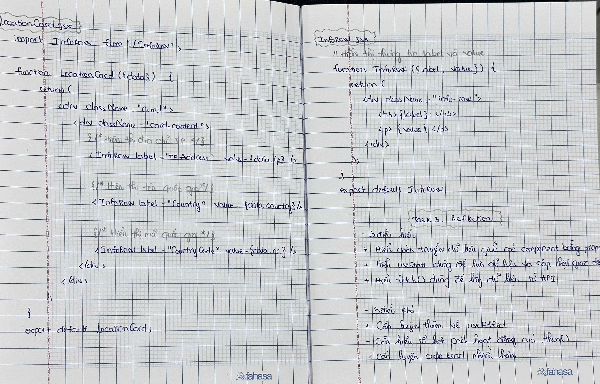

# Day 5 – Understanding My React App

Today, I rewrote my entire React project by hand while looking at my code. This helped me become more familiar with the structure of each component and how they work together.

I also added meaningful comments to explain why each important line of code exists instead of just describing what it does. While doing this, I reviewed concepts like `useState`, `useEffect`, `fetch()`, props, and component communication.

Finally, I reflected on what I understand better and what I still need to practice. I now have a better understanding of the overall flow of my application, from requesting data from the API to displaying it on the screen.

