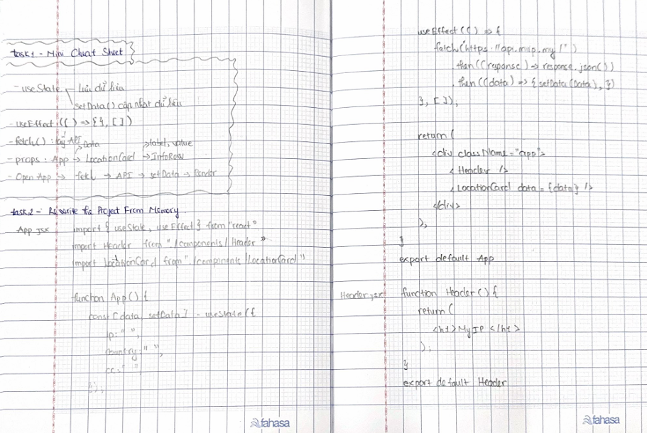
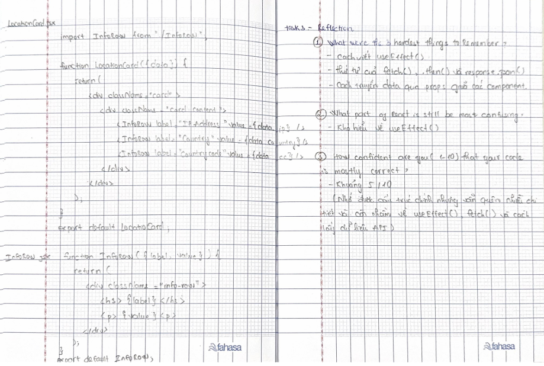

# Day 6 – Rewriting the Project from Memory

Today, I tried to rewrite my React project from memory instead of copying it from VS Code.

Before I started, I made a small cheat sheet with the most important ideas, such as useState, useEffect, fetch(), props, and the app flow. Then I put my code away and tried to rewrite all four components.

I remembered the overall structure of the project, but I forgot many details. I had the most trouble remembering useEffect(), the fetch() and .then() chain, and some JSX syntax. In several places, I had to make my best guess.

After comparing my work with the original code, I corrected my mistakes and wrote notes about what I forgot. This helped me see which parts I understand and which parts I still need to practice.

