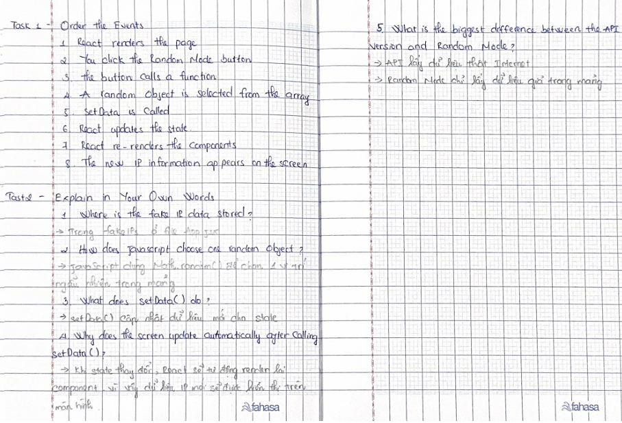

# Day 7 – Random Mode

Today I added a new feature called **Random Mode** to my React IP application.

I created an array with five fake IP addresses and added a button that randomly selects one item from the array. When I click the button, the app updates the state and displays the new IP information on the screen.

## What was easy

Creating the Random Mode button and showing a different IP address each time I clicked it.

## What was difficult

Understanding how the random function works. At first, I didn't understand how it chooses a random IP address from the array.

## What I learned

Today I learned how to use `Math.random()` to choose random data and `setData()` to update the React state.

