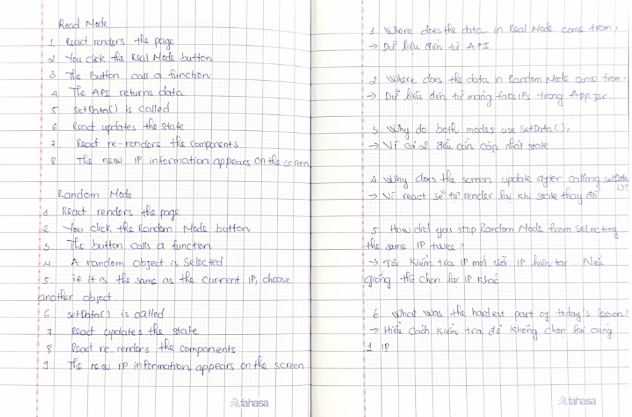

# Day 8 – Improve Real Mode and Random Mode

Today I improved my React IP application by adding a new feature and improving the existing one.

I added a **Real Mode** button to fetch my real IP information from the API. I also updated **Random Mode** so it does not select the same IP address twice in a row.

## What was easy

Adding the Real Mode button and fetching data from the API.

## What was difficult

Understanding how to compare the current IP with the new random IP before updating the state.

## What I learned

Today I learned how to use different functions to update the same React state and how to prevent Random Mode from showing the same IP twice.

