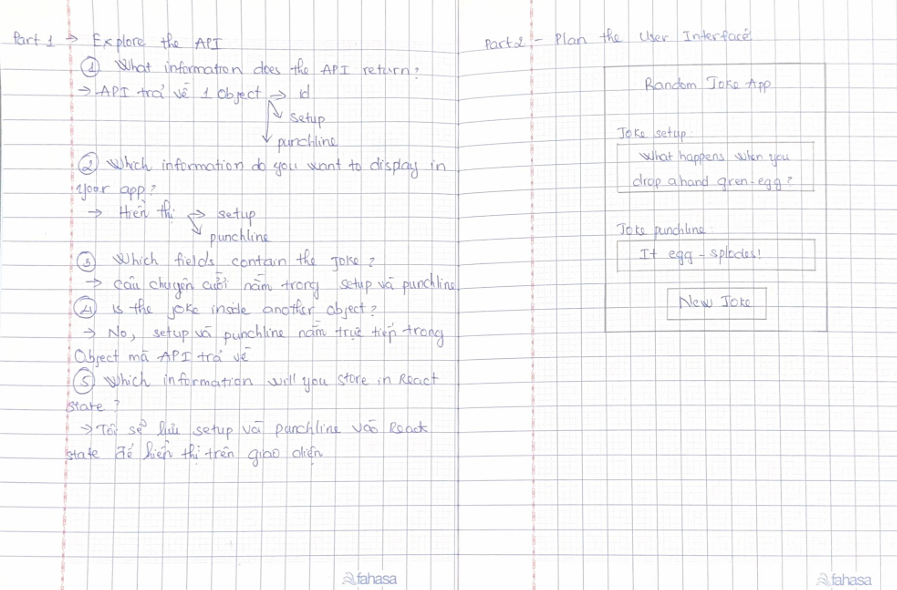
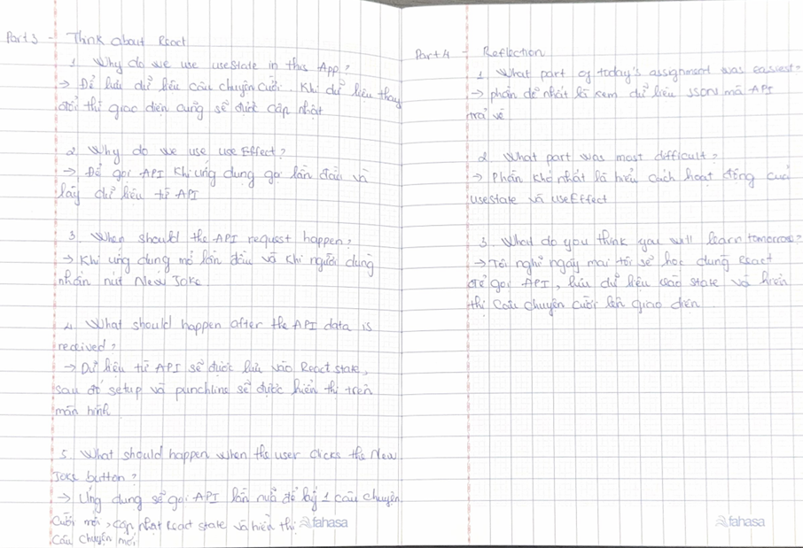

# Day 1 – Project 2: Random Joke App

## What I did today

Today I explored the Joke API and looked at the JSON response. I identified the data returned by the API, including the `id`, `setup`, and `punchline`.

I planned the user interface on paper. My design includes:
- App title
- Joke setup
- Joke punchline
- "New Joke" button

I also thought about how React will work in this project. I learned that `useState` can store the joke data, and `useEffect` can fetch a joke when the app loads. Clicking the **New Joke** button should request another joke from the API.

## Reflection

Today I didn't write any React code. Instead, I focused on understanding the API and planning the application before coding. I think this will make it easier to build the app tomorrow.

