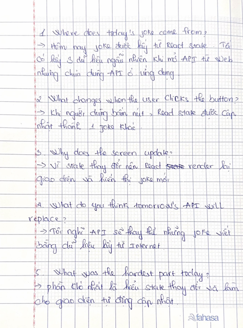

# Day 2 - Random Joke App

Today I built the basic React version of my Random Joke App without using the API.

I created reusable components for the header, joke card, and joke row. I used one React state object to store the current joke and displayed the setup and punchline on the screen.

I also created three different jokes and added a "New Joke" button. When the button is clicked, a random joke is selected and React updates the screen automatically.

Today I learned how changing React state changes what the user sees. I also practiced passing data and functions to child components using props.

