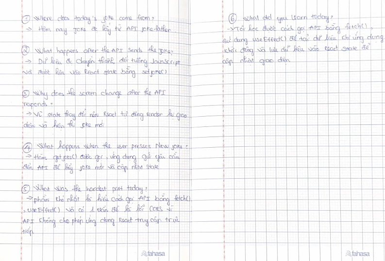

# Day 3 - Random Joke App

Today I updated my Random Joke App to load jokes from an API instead of using hard-coded jokes.

I used `fetch()` to request a random joke, `useEffect()` to load the first joke when the app starts, and React state to display the joke on the screen.

I also learned how API data flows into React state and how React automatically updates the user interface when the state changes.

One problem I faced was a CORS error. The API worked in the browser, but my React app could not access it because the server blocked the request.

Today I practiced using `fetch()`, `useEffect()`, and React state together to build a simple API-based application.

