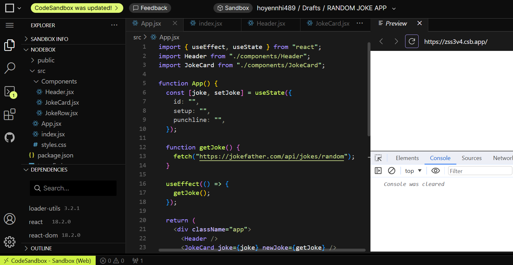
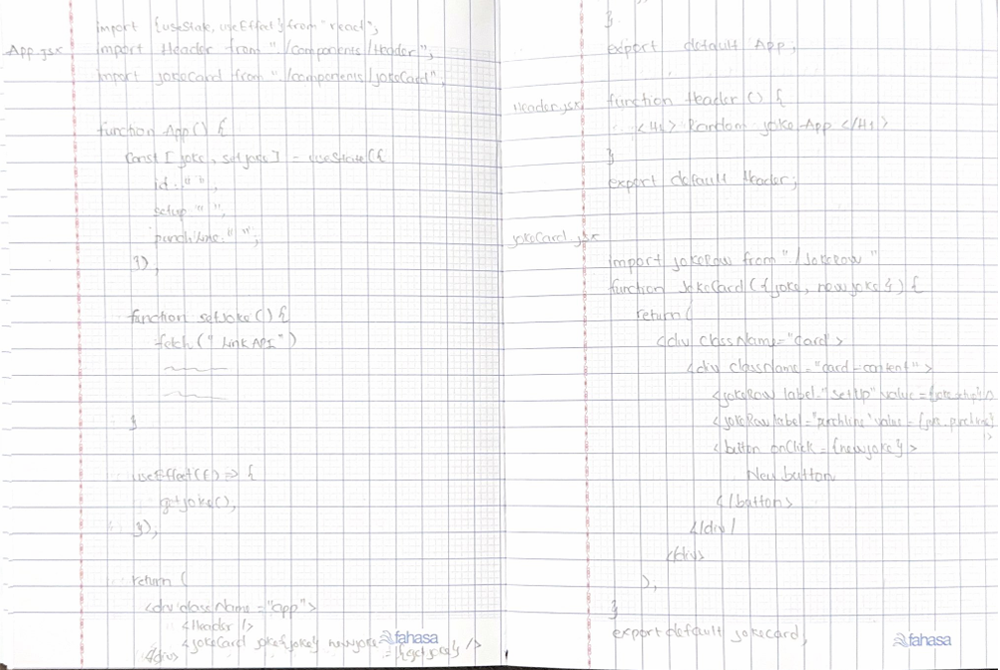
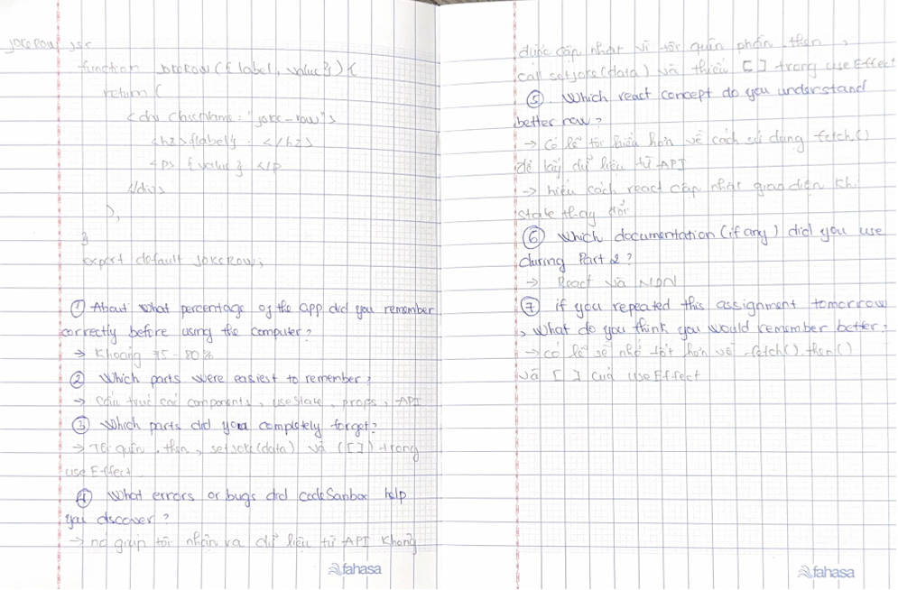

# Day 4 - Memory Challenge

Today I rebuilt my Random Joke App from memory without looking at my previous code.

I remembered most of the app, including the component structure, props, React state, and the API URL. I forgot some parts of the `fetch()` code and the dependency array in `useEffect`.

After comparing my code with yesterday's project, I fixed the missing parts and made the app work again.

Today I practiced remembering React code, finding mistakes, and improving my understanding by comparing my work with the correct solution.

