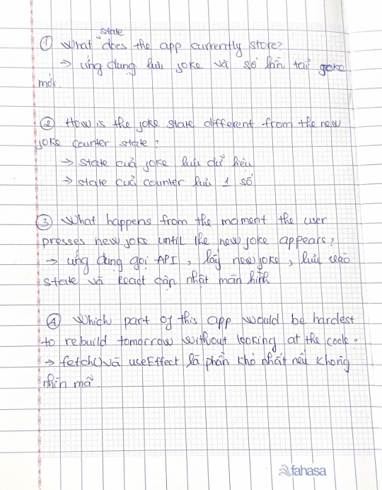

# Day 5 - New Joke Counter

Today I added a counter to my Random Joke App.

I used another React state to store the number of new jokes loaded. The counter starts at 0 and increases each time I click the "New Joke" button. I also made sure the first joke loaded when the app starts is not counted.

Today I learned how to use multiple React states in one component and reviewed how `useState`, `useEffect`, and `fetch()` work together.

I also reviewed the app and prepared for the live coding session by practicing the code and React concepts.

