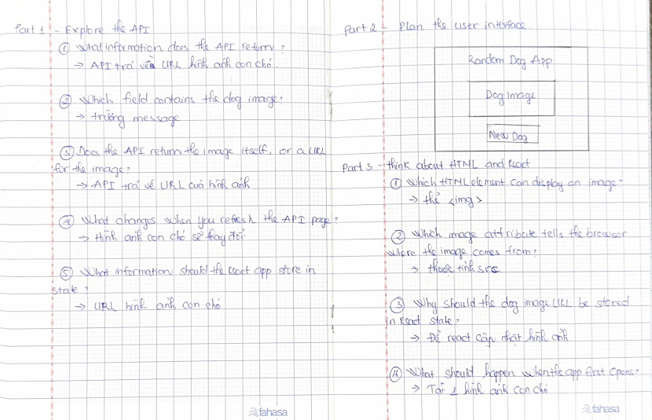
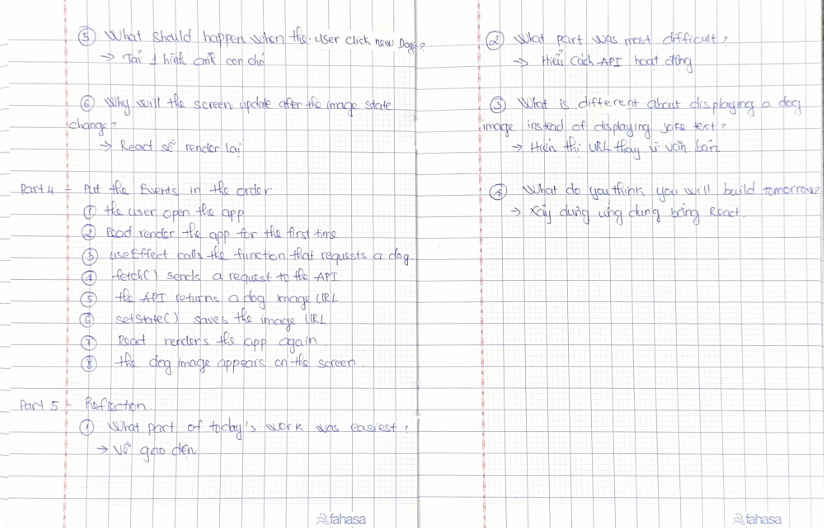

# Day 1 - Random Dog App

Today I explored the Dog API and learned what data it returns. I learned that the API returns a dog image URL in the `message` field. I also drew the app design and thought about how React will display the dog image. Today I did not write any React code. I only focused on understanding the API and planning the app.

