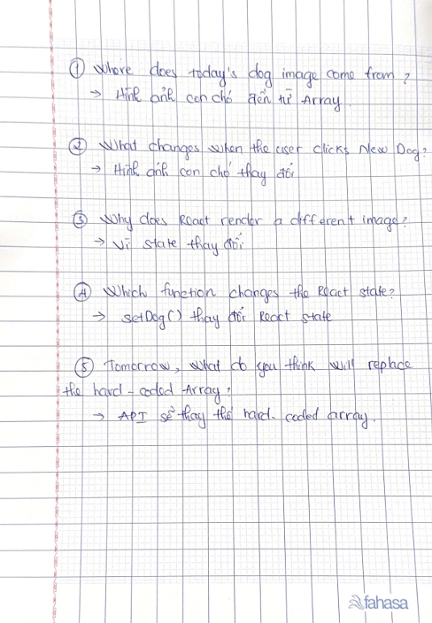

# Day 2 Journal

Today I built a Random Dog App. I used React state to store the dog image. I created an array with three image URLs and showed a random image when I clicked the button. Today I did not use the API. I learned more about React state.

