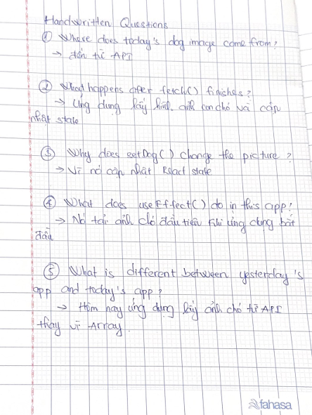

# Day 3 - Random Dog App

Today I replaced the hard-coded array with the Dog API. I used fetch() and useEffect() to load a random dog image. The easiest part was showing the image. The most difficult part was understanding how the API works. Today I learned more about fetch() and useEffect().

