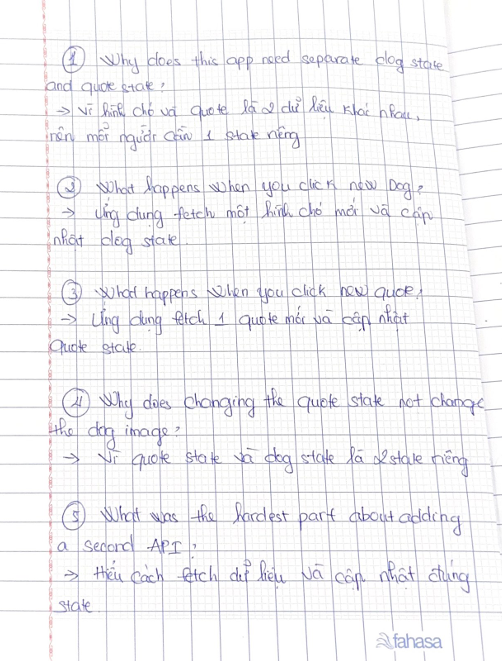

# Day 4 - Random Dog App

Today I added a random quote to my Random Dog App. I used a second API to get a random quote and author. I created another React state for the quote and used useEffect() to load both the dog image and the quote when the app starts. Today I learned how to use two APIs and two React states in one app.

