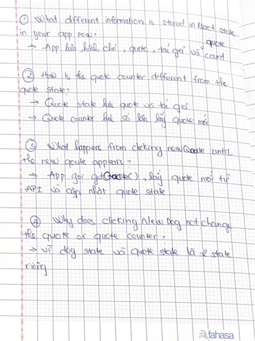

# Day 5 - Quote Counter

Today I added a quote counter to my Random Dog App. I used React state to count how many new quotes the user requested. The counter starts at 0 and increases every time I click New Quote. Today I learned more about using state to store different types of data.

