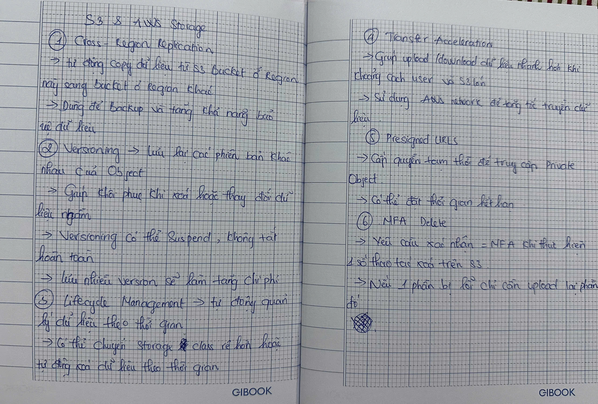

# S3 & AWS Storage – Paper Notes

### 1. Cross-Region Replication

**Cross-Region Replication (CRR)** → automatically copies data from an S3 Bucket in one Region to a Bucket in another Region.
→ Used for **backup** and improving **data protection**.

### 2. Versioning

**Versioning** → keeps different versions of an object.
→ Helps recover data when it is **accidentally deleted or changed**.
→ Versioning can be **Suspended**, but not completely disabled.
→ Storing multiple versions will **increase costs**.

### 3. Lifecycle Management

**Lifecycle Management** → automatically manages data over time.
→ Can **move data to a cheaper storage class** or **automatically delete** data after a certain period.

### 4. Transfer Acceleration

**S3 Transfer Acceleration** → helps upload/download data faster when the distance between the user and S3 is large.
→ Uses the **AWS network** to accelerate data transfer.

### 5. Presigned URLs

**Presigned URL** → provides temporary access to a **Private Object**.
→ Can set an **expiration time**.

### 6. MFA Delete

**MFA Delete** → requires **MFA** confirmation when performing certain delete operations on S3.

